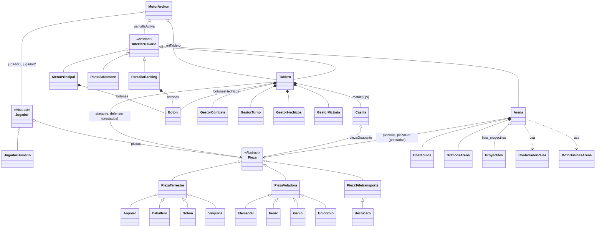

**ARCHON 2026**

Proyecto de informatica industrial y comunicaciones inspirado en el juego Archon.

********************************************************************
**Características**
********************************************************************
-Menú con las opciones de nueva partida,ranking,manual del juego y salir.

-En la opcion de nueva partida se puede seleccionar entre jugador vs jugador o jugador vs IA (no implementado).

-Elegida la opción jugador vs jugador se puede seleccionar entre 3 temáticas que afectarán sólo al apartado visual del juego:

   -Archon clásico
   
   -Harry Potter
   
   -Star Wars

-Una vez seleccionado el ambiente se cargará un tablero de 9x9 con 8 piezas distintas por bando.

**Cada pieza se comporta de una forma específica:(ARCHON,HARRY POTTER,STAR WARS)**

**LUZ**:CABALLERO,DOBBY,REBELDE || **OSCURIDAD**:GOBLIN,GRIPHOOK,STORMTROOPER

**LUZ**:ARQUERO,HARRY POTTER,HAN SOLO || **OSCURIDAD**:MANTICORA,DOLORES UMBRIDGE,BOBBA FETT

**LUZ**:VALQUIRIA,HERMION,LEIA || **OSCURIDAD**:BANSHEE,BELLATRIX,TUSKEN

**LUZ**:GOLEM,HAGRID,CHEWBACCA || **OSCURIDAD**:TROLL,TROLL,GUARDIA REAL ROJO

**LUZ**:UNICORNIO,UNICORNIO,LANDO CARLISSIAN || **OSCURIDAD**:BASILISCO,BASILISCO,BOSSK

**LUZ**:GENIO,NICK CASI DECAPITADO,OBI-WAN || **OSCURIDAD**:SHAPESHIFTER,BOGGART,IG-88

**LUZ**:HECHICERO,DUMBLEDORE,YODA || **OSCURIDAD**:HECHICERA,VOLDEMORT,EMPERADOR PALPATIN

**LUZ**:FENIX,FAWKES,LUKE SKYWALKER || **OSCURIDAD**:DRAGON,DEMENTOR,DARTH VADER

-Cuando dos piezas entran en combate, la lucha se translada a una arena donde sobrevive el mejor.

-Cunado una pieza es derrotada desaparece del tablero.

-Existen 3 formas de lograr la victoria:

   -Controlar los 5 puntos de poder.
   
   -Eliminar todas las piezas del contrincante.
   
   -Encarcelar la última pieza del contrincante

-Una vez se logra la victoria se introduce/selecciona tu nombre y el resultado se refleja en el ranking.

-Se vuelve al menú principal acabada la partida.

*************************************************************
**REQUISITOS**
**************************************************************

Es necesario tener compilador con C++17 y la librería SFML 3.0 o superior

***********************************************************************
**CONTROLES**
***********************************************************************
-El menú se navega con el ratón.

-Las piezas del tablero se desplazan con el ratón:

   -Seleccionas la pieza a mover y posteriormente a la casilla donde deseas que se mueva.
   
   -En caso de querer des-seleccionar la pieza para seleccionar otra se debe volver a pulsar sobre la pieza.
   
   -La pieza sólo se moverá a la casilla de destino si el movimiento es válido.

-En la arena se juega con el teclado: 

   -El bando de luz juega con aswd y 1 para disparar.
   
   -El bando de oscuridad con las flechas y 0 para disparar.

-Si se selecciona al hechicero se abre un menú lateral para seleccionar los hechizos disponibles.

************************************************************************
**AUTORES**
************************************************************************
Dimitar Veselinov Dzhumbeshliev

Inés López-Boado Rodriguez

Pablo Muñoz Moreno

